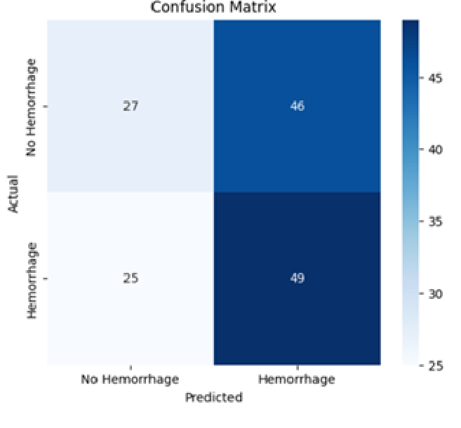

# Intracranial Hemorrhage Detection using ML & Deep Learning

## Overview
This project focuses on detecting intracranial hemorrhage from non-contrast CT scan images using Machine Learning and Deep Learning models.

The project compares multiple approaches including:
- Multi-Layer Perceptron (MLP)
- LightGBM
- CNN
- MobileNetV2
- EfficientNetB0
- ResNet50

The work also explores:
- Transfer Learning
- CLAHE preprocessing
- Monte Carlo Dropout
- Uncertainty Quantification
- Model Calibration

## Dataset
CQ500 Dataset

## Technologies Used
- Python
- TensorFlow / Keras
- Scikit-learn
- OpenCV
- LightGBM
- NumPy
- Pandas
- Matplotlib
## Results
## Results

### ROC Curve
  ROC.png)


### Confusion Matrix

## Repository Structure
```text
Intracranial-Hemorrhage-Detection/
│
├── notebooks/
├── src/
├── results/
├── figures/
├── models/
├── README.md
└── Irin_Thomas_Thesis-23054032.pdf
